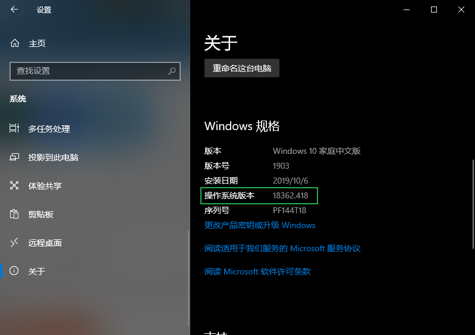
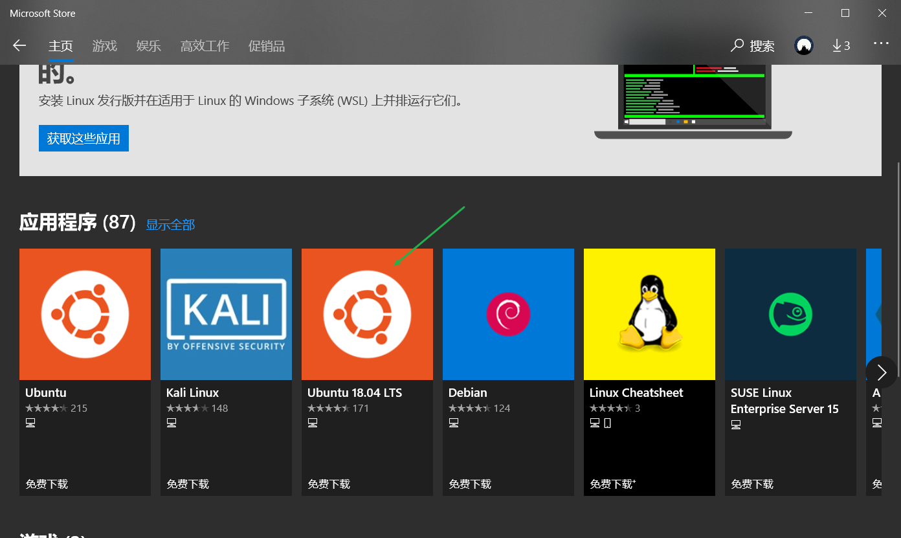
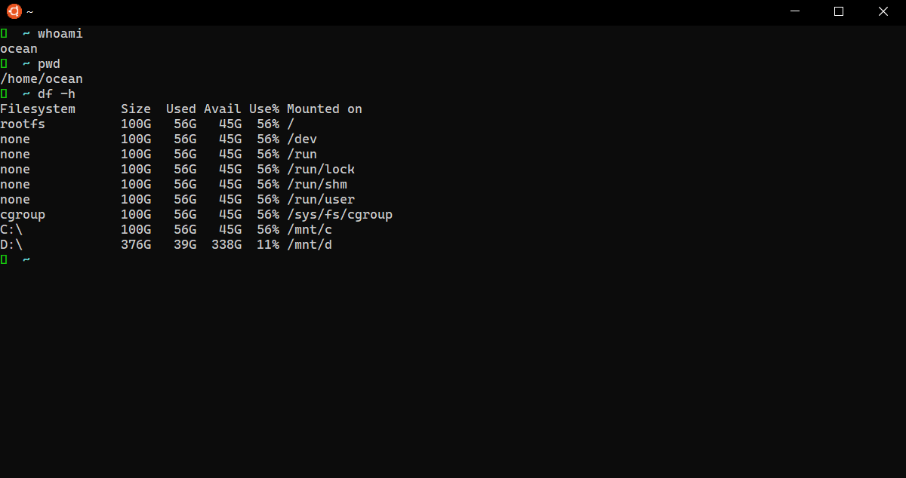
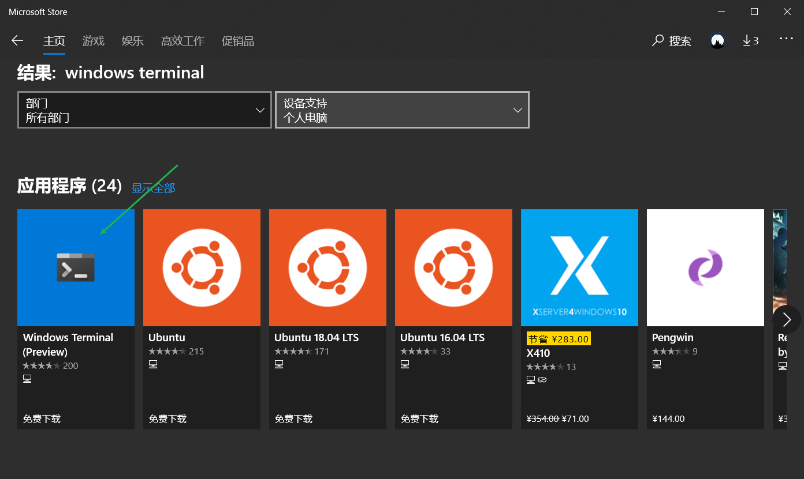
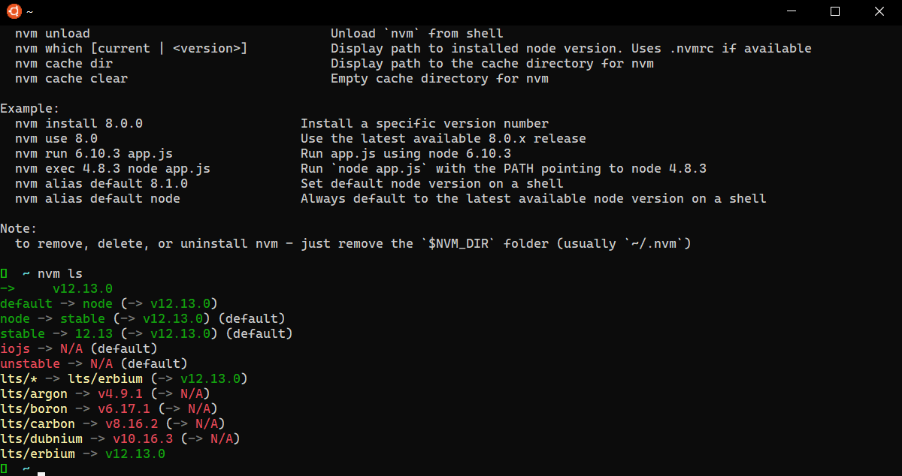
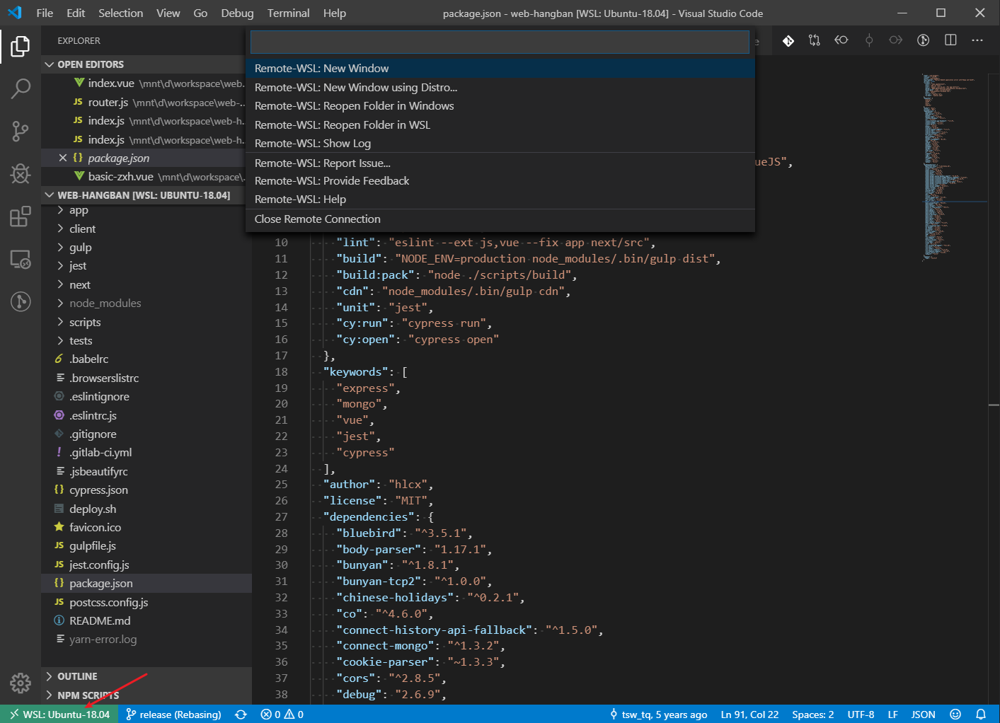
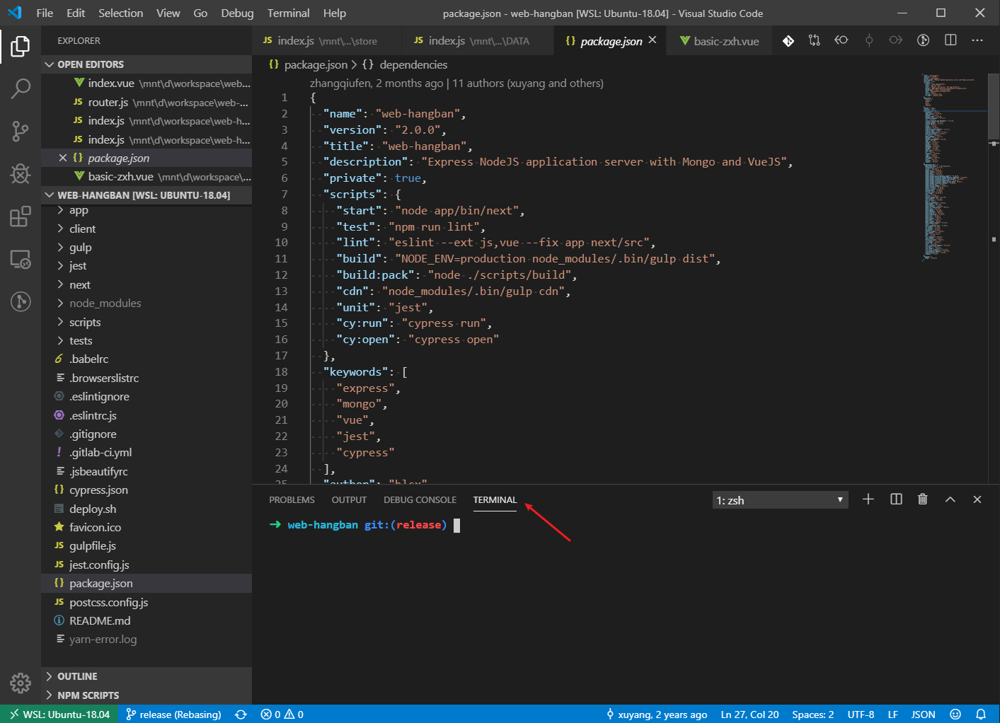

# WSL前端环境搭建

前段时间mac烧了，换了一台windows的电脑作为开发机，发现这么一个好玩意WSL，完全解决了windows上前端开发的问题。

## 痛点

1. windows上会遇见各种奇怪的问题，比如node-sass的编译过程、路径问题等等。
2. 必须要能编译小程序，必须要能装微信、QQ，所以ubuntu等linux就只能byebye。
3. mac太贵，配置还低，按照教授的说法，乔帮主走后苹果已经失去灵魂(主要还是因为穷)。

## 什么是WSL？

WSL 全称为 Windows Subsystem for Linux，是一个为在 Windows 10 上能够原生运行 Linux 二进制可执行文件（ELF格式）的兼容层。

## WSL有什么用，和虚拟机有什么区别？

1. 性能更好, 由于实现更加底层，所以性能要比虚拟机好很多。(心疼张老师以前在ubuntu上跑windows的虚拟机，看微信和编译小程序)
2. 与 Windows 共享的文件系统。是的，用linux的系统直接访问windows硬盘中的所有文件，甚至可以运行.exe文件（windows可执行文件）。

## 系统要求

安装子系统要求 Windows 10 Fall Creators Update 及之后版本，从这个版本开始，子系统才正式对外发布，之前的版本需要打开开发者选项。




我们可以在设置中选择系统—-关于-—Windows 规格，来查看 Windows 版本号，大于 16215 就可以了。

## 安装

首先，以管理员身份打开 PowerShell 并运行：

```
Enable-WindowsOptionalFeature -Online -FeatureName Microsoft-Windows-Subsystem-Linux
```

之后，在 Microsoft Store 搜索 Linux，安装想要的 Linux 分发。



我选的 Ubuntu 18.04 LTS。

Microsoft Store 装软件十分简单，只需要点一点就好了。之后开始菜单中就会出现 Ubuntu 的icon。点击启动。

## 使用

启动后，第一次需要初始化较长时间，之后会让设置一个系统的账号密码，和 Windows 的账号密码是有没有关系，的可以随便设，但遗忘不能找回，需要注意。

启动后就和使用虚拟机一样的感觉：



从子系统中是**可以直接访问 Windows 路径中的文件**的，Windows 中的磁盘挂载在了 /mnt 目录下。

## 开发环境配置

### 安装终端

windows默认的终端真的是太丑啦，而终端的配置选项又很有限。

可以在Microsoft Store中安装 Windows Terminal。虽然只是Preview，真的是太好用了，可以改字体、字号、颜色啥的。



### 安装oh-my-zsh

安装 oh-my-zsh 和在 Mac 中是一样的， 直接执行：

```
sh -c "$(curl -fsSL https://raw.githubusercontent.com/robbyrussell/oh-my-zsh/master/tools/install.sh)"
```

### 安装Node.js

1. 先安装nvm（Node Version Manager）

```
curl -o- https://raw.githubusercontent.com/creationix/nvm/v0.33.8/install.sh | bash
```

2. 用nvm安装node.js

```
nvm install node
```

安装完可以查看一下结果，我安装的是12.13.0版本



### 安装Git

直接使用Ubuntu上面的安装方法：

```
sudo apt update
sudo apt install git
```

### VS Code

开发环境，离不开代码编辑器。现在我们已经可以做到命令行工具运行在 Linux 下了，接下来要做的就是让 VS Code 适配 WSL。

在 VS Code 的 insider 版本中，已经支持了 Remote Development with VS Code，Remote Development 功能可以让我们流畅的在 WSL 中进行开发。



为了使用方便，我们把默认 terminal 从 bash 改成 zsh，在 VS Code 的选项中修改：

打开命令行试试，已经是在 WSL 环境中了，我把terminal已经改成了zsh：



完美，是不是已经跟mac环境没啥区别了。

## 后记

还在用git-bash 或者cygwin 等模拟工具的同学，赶快切换到WSL上来吧，你值得拥有。

土豪请直接上Mac顶配版本，Mac系统更优秀的渲染机制，更优雅的字体，更优秀的调色方案，你值得拥有。

喜欢折腾的同学，可以做一个Mac、Windows双系统，然后在Windows里面再安装一个WSL，你就是公司最靓的仔。
